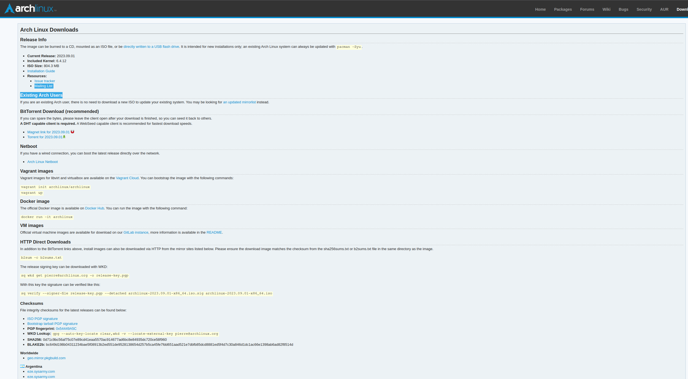
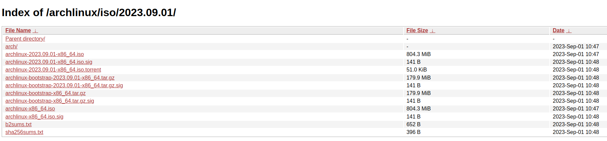

.. _ArchInstall:

***********************
Arch Linux Installation
***********************
This section describes a process that can be used to install Arch Linux
on a computer system that uses a UEFI based hard drive, which is the most
comman type sold in standard Windows and Linux computers.  In addition,
these instructions assume that the reader has access to a working computer
to download some necessary files.

**NOTE:** This instructions in this section were crafted for a Dell XPS computer
that came pre-installed with Ubuntu Linux.  Their may be some extra steps not 
described in this document for someone using a computer that was pre-installed
with windows.  These steps will occur in the beginning of the process to
prepare the computer when in Bios mode prior to installation.  The reader
of this document should investigate these steps prior to beginning the process
as outlined in this document.

Pre-Installation Activities
===========================
Before we start the Arch Linux installation 
we need to download an Arch Linux iso file and flash the distribution to a 
thumb drive.

Download an ISO file.
---------------------
Navigate to the `Arch Linux <https://archlinux.org/download/>`_ directory 
where you can access the iso files. You should see a screen similar to the 
one shown below, displaying applicable web sites by country.

Navigate to the section that contains the country you are currently in
and click on any of the available web sites.  You should get a result
like the one shown below.

Find the link that ends with the ``.iso`` suffix and has a data associated
with it.  In this case it would be the ``archlinux-2023-09-01-x86_64.iso``
file.  Click on the link and save it to a thumb drive.  Ensure that there 
is no other data on your thumb drive.  If your thumb drive contains data other 
than the ``.iso`` file back it up somewhere else, since the flash process 
will destroy that data.

Flash the Distribution to a Thumb Drive
---------------------------------------
Once the ``iso`` file has been saved to a thumb drive we need to flash the 
distribution to the drive so we can use it as a bootable drive for the 
installation process. There are several utility programs that can be used
to transform a thumb drive into a bootable drive, but I prefer to use 
`USB Imager <https://gitlab.com/bztsrc/usbimager>`_.  The following image
shows an example of the download options in these
`USB Imager <https://gitlab.com/bztsrc/usbimager>`_

.. image:: images/usb_imager.png
   :alt: USB Imager download options

Pick the option that is best suited to the computer you are using to the operating
system you are using to download and flash the thumb drive.  Once you click
on an option it should download an installer.  Once you have installed USB Imager 
you should have access to a GUI that looks like the image below.

.. image:: images/imager.png
   :alt: The USB Imager Graphical user Interface

Ensure that the ``.iso`` file is the only file on the thumb drive.  Then click 
on the three dots in the upper right icon to search for your thumb drive in
the filesystem.  Ensure that the verify button is checked, then click on
the Write icon.  This will start the process of flashing the ``.iso`` to the 
flash drive.

Arch Linux Linux Installation 
=============================
Now that the thumb drive has been flashed with the Arch Linux ``.iso`` file,
we are prepared to use it as a mechanism to install Arch Linux on your computer.
Ensure that the computer is powered off, and insert the thumb drive into its interface 
with the computer.  Also, if possible try to complete this process with a hard 
link internet connection in case their are issues with wireless during the 
install process.

Boot your computer into the Bios mode by turning the computer 
on and then repetatively depressing the F12 key.  Once booted into Bios mode you
should see an option for different boot menus, to include a boot option for
your USB drive.  Click on this option, and it will boot from the flash drive. 
This boot option is commonly known as bpooting into live mode.  Once booted 
you should see several options, which may change from version to version; 
however, you should see an option for the following.

.. code-block:: bash

   Arch Linux install medium (x86_64, UEFI)

Use the up or down arrow keys to navigate to this option if you are not 
already hovering on this option.  Click enter, and this will enter into
the Arch Linux installation process.

**NOTE:** The instructions listed above may not work for a computer that 
has a Bios tailored for windows.  Ther may be some bios options that you will
have to manually change, but these are beyond the scope of this document.

Set up the Keyboard Layout
--------------------------
**NOTE:** If you are using a keyboard with a U.S. layout, you can skip
this step, unless you wish to use a different keyboard layout.

#. View the keyboard layout options with the following command

   .. code-block:: bash

      ls /usr/share/kbd/keymaps/**/*.map.gz

#. Change the layout with the ``loadkeys`` option.  The following is an example
   if a user wanted to use the ``de-latin`` layout.

   .. code-block:: bash

      loadkeys de-latin

Set Up Wireless
---------------
If you have a hard wire connection to the internet, you do not need to
complete this section.  However, if you intend to use wireless once 
the distribution is installed, it is recommended that you complete this 
section.

#. Check to see if you are currently connected to the internet with the 
   following command.

   .. code-block:: bash

      ip a 

   The above command should yield a result similar to the following;

   .. code-block:: bash

      1: lo: <LOOPBACK,UP,LOWER_UP> mtu 65536 qdisc noqueue state UNKNOWN group default qlen 1000
         link/loopback 00:00:00:00:00:00 brd 00:00:00:00:00:00 
         inet 127.0.0.x/x scope host lo 
         valid_lft forever preferred_lft forever 
         inet6 ::1/128 scope host
         valid_lft forever preferred_lft forever
      2: wlp0s20f3: <BROADCAST,MULTICAST,UP,LOWER_UP> mtu 1500 qdisc noqueue state UP group default qlen 1000
         link/ether fc:44:82:a4:7a:63 brd ff:ff:ff:ff:ff:ff
         inet xxx.xxx.xx.xx/24 brd xxx.xxx.xx.xxx scope global dynamic noprefixroute wlp0s20f3
         valid_lft 69747sec preferred_lft 69747sec
         inet6 fe80::6cd:4d12:77c7:1c40/64 scope link no

#. Most likely the output you will receive to the previous step is like the 
   above example.  If this is the case, then you will need to enter the ``iwctl``
   utility to set up your wireless.  If this is the case, you should complete the 
   following steps.  If not, and your wireless is connected, you can skip this 
   section.

   .. code-block:: bash 

      iwctl 

#. Check the device name with the following command.

   .. code-block:: bash

      device list 

   **NOTE:** In my case the device name is ``wlan0``, which I will use in place of
   device name from her on out.

#. Scan for available networks.

   .. code-block:: bash 

      station wlan0 scan 

#. Query for the available networks.  The previous step is required to determine the
   list of available networks which are output to the user with this command.

   .. code-block:: bash

      station wlan0 get-networks

#. If your wireless network does not show up in this list, you may need to troubleshoot
   your wireless to ensure it is properly transmitting.  Assuming your network is in this
   list you need to enter the following command and replace ``NetworkName`` with the name 
   of your network.

   .. code-block:: bash

      station wlan0 connect "NetworkName"

   This command should lead to a prompt asking you to enter the password for your 
   network.

#. Exit the ``iwctl`` prompt by simultaneously depressing the Control and d keys
   (i.e. Control-d).

#. Verify that wireless is working correctly with the following command.

   .. code-block:: bash 

      ip a

   This should reproduce the output from step 1, but with a slightly different
   output indicating that wirless is connected.  If the output is the same, you 
   may need to repeat the steps in this section starting at step 1.

#. Assuming the previous step worked correctly, test the connection. This step 
   will ping the google server five times.  If this does not return all packets
   with 0% loss, you may need to repeat the steps in this section

   .. code-block:: bash

      ping -c 5 8.8.8.8

Set Up the Partition Table
--------------------------
In this section we will overwrite the partition table in your computer 
to one that will accomodate Logical Volume Management (LVM).  LVM is not 
necessary for a personal computer; however, it is very advantageous
when setting up a server, and it provides flexibility for resizing memory
even on a personal computer.  Throughout this section, you can abandon the 
setup process and still boot back into the operating system originally 
installed on your computer.  However, once you execute the final step in
this section, it will wipe your existing OS from memory.  If you wish to
learn more aboute LVM you can click on the following link for 
`LVM <https://www.youtube.com/watch?v=MeltFN-bXrQ>`_.

**NOTE:** From this point onwards, the installation instructions may potentially
change with each newer version of the Arch Linux installer.  The user should consult
with the `Arch Linux Installation <https://wiki.archlinux.org/title/installation_guide>`_ 
instructions to ensure that the following steps are still valid.

#. Determine the name for your device with the following command.

   .. code-block:: bash 

      fdisk -l

   The above command will display a list of all hard drives installed on
   your computer, to include your thumb drive, which will likely be labelled
   as ``sda``.  It is very likely that your computer hard drive will be
   listed as ``nvme0n1px`` where the ``x`` may represent a partition.  For 
   the rest of these steps I will refer to the hard drive as ``nvme0napx``;
   however, be sure to replace this with the name of your drive.

#. Enter the partition manager with the following command

   .. code-block:: bash 

      fdisk /dev/nvme0n1 

#. Start a new gpt partion layout table with the following command; 

   .. code-block:: bash

      g 

#. Initialize the first 500 MB partition with the command;

   .. code-block:: bash 

      n 

   This should yield the following questions, where the user should enter
   the value between quotes to each question.

   .. code-block:: bash 

      -Partition number (1-128, default 1): 'press enter to accept default'
      -First sector (some numbers, default 2048) 'press enter to accept default'
      -Last sector, +/- sectors or +/- size{K,M,G,T,P} (some numbers, default 1048575966)
       '+500M' 
   
   This should result in the response

   .. code-block:: bash

      Create a new partition 1 of type 'Linux Filesstem' and of size 500 MiB

#. Set the first partition to be a Linux EFI Partition 

   .. code-block:: bash

      t 

   This should lead to the following prompt 

   .. code-block:: bash 

      -Partition type or alias (type L to list all):

   You can type ``L`` to list the available types.  Type the number
   associated with ``EFI Filesystem``.  As of the date this
   document was written, this should be option ``1``.  When entered
   correctly, this installer should provide the following response.

   .. code-block:: bash

      -Chaged type of partition 'Linux' filesystem to 'EFI System'

#. Create the second 500 MB partition.

   .. code-block:: bash 

      n

   This should yield the following questions and user responses in quotes.

   .. code-block:: bash

      -Partition number (2-128, default 2): 'press enter to accept default'
      -First sector(some numbers, default 1026048): 'press enter to accept the default'
      -Last sector, +/- sectors or +/- size{K,M,G,T,P} (some numbers, default 1048575966)
       '+500M' 
   
   This should result in the response

   .. code-block:: bash

      Create a new partition 2 of type 'Linux Filesstem' and of size 500 MiB

   Unlike the previous partition we will not format this partition and will
   instead do that at a later time.

#. Create the 3rd and final partition.

   .. code-block:: bash 

      n

   This should yield the following prompt and responses listed in quotes.

   .. code-block:: bash

      -Partition number (3-128, default 3): 'press enter to accept the default'
      -First sector (some numbers, default 2050048): 'press enter to accept the default'
      -Last sector, +/- sectors or +/- size{K,M,G,T,P} (some numbers, default 1048575966)
       'Press Enter to size the partition to the remaining disk space'

#. Set the final partition type.

   .. code-block:: bash 

      t

   This should yield the following prompt and responses in quotes.

   .. code-block:: bash

      -Partition number(1-3, default 3): 'press enter to accept the default'
      -Partition type or alias (type L to list all) '44'

   **NOTE:** As of the date of this document draft, the correct option to
   the second question is ``44``; however, this may change.  The user should
   press ``L`` and look for the option that yields ``Linux LVM``. If
   correctly entered this should yield the following response.

   .. code-block:: bash

      Change type of partition 3 'Linux Filesystem' to 'Linux LVM'.

#. Verify the partition layout

   .. code-block:: bash

      p

   This should yield something like

   .. code-block:: bash

      Device          Start   End     Sectors    Size    Type
      /dev/nvme0n1p1  XXX     XXX     XXX        500M    EFI System
      /dev/nvm10n1p2  XXX     XXX     XXX        500M    Linux Filesystem
      /dev/nvme0n1p3  XXX     XXX     XXX        REMG    Linux LVM 

   **NOTE:** If the output at this step does not show the following
   partitions, you may need to repeat all steps in this section.

#. Finalize changes to partition layout.  Be warned, that once you execute
   this step it will delete your current operating system and all saved data.

   .. code-block:: bash

      w

#. Format partitions.  This will format your first partition as a ``vfat``
   file structure and the second as ``ext4``.

   .. code-block:: bash

      mkfs.fat -F32 /dev/nvme0n1p1
      mkfs.ext4 /dev/nvme0n1p2 

#. Set up encryption on the 3rd partition.  Click yes when you re asked and be
   be prepared to enter a password of your choosing.  Also, notice this is
   the first step where we reference our drive by a specific partition.

   .. code-block:: bash

      cryptsetup luksFormat /dev/nvme0n1p3

#. Unlock the encrypted drive

   .. code-block:: bash

      cryptsetup open --type luks /dev/nvme0n1p3 lvm

#. Set up LVM with the following commands.

   .. code-block:: bash

      pvcreate --dataalignment 1m /dev/mapper/lvm
      vgcreate volgroup0 /dev/mapper/lvm
      lvcreate -L 100GB volgroup0 -n lv_root
      lvcreate -l 100%FREE volgroup0 -n lv_home
      modprobe dm_mod
      vgscan
      vgchange -ay 

   **NOTE:** This should find and activate 2 logical volumes.

#. Format the logical volumes with the following commands.

   .. code-block:: bash

      mkfs.ext4 /dev/volgroup0/lv_root
      mount /dev/volgroup0/lv_root /mnt
      mkdir /mnt/boot
      mount /dev/nvme0n1p2 /mnt/boot
      mkfs.ext4 /dev/volgroup0/lv_home
      mkdir /mnt/home
      mount /dev/volgroup0/lv_home /mnt/home
      mkdir /mnt/etc
      genfstab -U -p /mnt >> /mnt/etc/fstab 

#. Verify that the previous commands correctly set up ``fstab``.

   .. code-block:: bash

      cat /mnt/etc/fstab

   Which should yield 

   .. code-block:: bash

      /dev/mapper/volgroup0-lv_root
      UUID=random number     /        ext4 rw,relatime 0 1
      /dev/nvme0n1p2
      UUID=random number     /boot    ext4 rw,relatime 0 2
      /dev/mapper/volgroup0-lv_home
      UUID=random number     /home    ext4 rw,relatime 0 2 

Install Arch Linux
------------------
At this point we need to install Arch Linux on our computer.

#. Install the base packages

   .. code-block:: bash

      pacstrap -i /mnt base

#. Enter root 

   .. code-block:: bash 

      arch-chroot /mnt

#. Install Linux

   .. code-block:: bash

      pacmman -S linux linux-headers linux-firmware

   **NOTE:** You can also install linux-lts (long term support), which
   is a more stable kernel that is not updated as often as the pure
   linux distribution.  However, the Linux foundation recently announced
   that they will discontinue lts in the near future.  If you did decide
   to install lts in addition, the command would like like the example 
   below.

   .. code-block:: bash

      pacmman -S linux linux-headers linux-lts linux-lts-headers linux-firmware

#. Install neovim to assist in the editing of configuration files 

   .. code-block:: bash 

      pacman -S neovim 

#. Install more base packages for wireless internet

   .. code-block:: bash

      pacman base-devel openssh

#. Enable ssh to ensure it starts when your computer does

   .. code-block:: bash

      systemctl enable sshd

#. Install networking packages

   .. code-block:: bash

      pacman -S networkmanager wpa_supplicant wireless_tools netctl dialog

#. Enable the network manager

   .. code-block:: bash

      systemctl enable NetworkManager

#. Install LVM support 

   .. code-block:: bash

      pacman -S lvm2

#. Make some necessary changes in the ``mkinitcpio.conf`` file.

   .. code-block:: bash

      nvim /etc/mkinitcpio.conf

   Look for a line that has the following information in the file.

   .. code-block:: bash

      HOOKS=(base udev autodetect modconf block filesystem keyboard fsck)

   Modify the line to read as below and then save

   .. code-block:: bash 

      HOOKS=(base udev autodetect modconf block encrypt lvm2 filesystem keyboard fsck) 

   **NOTE:** The unmodified line may change from one version to another, button
   look for the line that is most similar to the original line described in
   this step.

#. Type the following command to make the changes to the ``mkinitcpio.conf``
   file take effect.

   .. code-block:: bash

      mkinitcpio -p linux

   **NOTE:** If you also installed the lts linux kernel the command will look
   like

   .. code-block:: bash

      mkinitcpio -p linux
      mkinitcpio -p linux-lts

   This command should yield a lengthy output and you should see ``[lvm]`` and 
   ``[encrypt]`` in the output.

#. Edit the ``local.gen`` file.

   .. code-block:: bash 

      nvim /etc/locale.gen

   Find the line that looks like;

   .. code-block:: bash 

      #en_US.UTF-8 UTF-8 

   Uncomment the line so it looks like the example below and save the 
   file.

   .. code-block:: bash 

      en_UT.UTF-8 UTF-8 

#. Activate the changes with the following command.

   .. code-block:: bash 

      locale-gen

#. Set the root password 

   .. code-block:: bash 

      passwd 

#. Add yourself as a user.  Replace myname with your username.

   .. code-block:: bash 

      useradd -m -g users -G wheel myname 
      passwd myname

#. Ensure sudo is installed.

   .. code-block:: bash

      which sudo 

   If this does not provide a response, you will need to install sudo.

   .. code-block:: bash 

      pacman -S sudo

#. Associate the user with wheel and all privileges

   .. code-block:: bash 

      EDITOR=vim visudo

   This should enter into the visudo file.  Find the line that reads as 

   .. code-block:: bash 

      #%wheel ALL=(ALL) ALL 

   Uncomment this line to look like 

   .. code-block:: bash 

      %wheel ALL=(ALL) ALL

   **NOTE:** If you are adding a user other than yourself, you may want to
   specify other privileges in this command.

Install the GRUB Bootloader 
---------------------------
At this point, while we do have Linux installed, the computer will still
not boot because we have not installed a boot loader.  We will use GRUB 
as the boot loader for our computer.

#. Install GRUB and related packages.

   .. code-block:: bash 

      pacman -S grub efibootmgr dosfstools os-prober mtools 

#. Create the following directory.

   .. code-block:: bash

      mkdir /boot/EFI
      mount /dev/nvme0n1p1 /boot/EFI 

#. Install GRUB to the master boot record.

   .. code-block:: bash 

      grub-install --target=x86_64-efi --bootloader-id=grub_uefi --recheck 

#. Check to see if the locale directory exists.

   .. code-block:: bash 

      ls -l /boot/grub/ 

   If it does not exist create it.

   .. code-block:: bash 

      mkdir /boot/grub/locale

#. Copy a specifc file from the ``/usr`` to ``boot`` directories.

   .. code-block:: bash 

      cp /usr/share/locale/en\@quot/LC_MESSAGES/grub.mo /boot/grub/locale/en.mo 

#. Edit the ``grub`` file.

   .. code-block:: bash 

      nvim /etc/default/grub 

   Look for the line that looks like 

   .. code-block:: bash 

      GRUB_CMDLINE_LINUX_DEFAULT="loglevel=3 quiet"

   And change it to look like;

   .. code-block:: bash 

      GRUB_CMDLINE_LINUX_DEFAULT="cryptdevice=/dev/nvme0n1p3:volgroup0:allow-discards loglevel=3 quiet"
     
#. Generate the GRUB configuration file.

   .. code-block:: bash 

      grub-mkconfig -o /boot/grub.cfg

#. At this point, if we did everything correct we should be able to reboot
   our hard drive.  Lets test our boot configuraiton.

   .. code-block:: bash 

      exit 
      umount -a 
      reboot 

   If all goes well this should reboot our computer and prompt us to
   enter our username and password, and then boot back into a command 
   line terminal.

Post Install Tweaks
-------------------
If you made it this far then I am assuming you were able to reboot your 
computer.  Now lets do some post-install tweaks to our OS.

#. Assume the root user 

   .. code-block:: bash 

      su 
      cd /root

#. Create and activate a swap file with the following commands

   .. code-block:: bash 

      dd if=/dev/zero of=/swapfile bs=1M count=2048 status=progress
      chmod 600 /swapfile
      mkswap /swapfile
      cp /etc/fstab /etc/fstab.bak
      echo '/swapfile none swap sw 0 0' | tee -a /etc/fstab
      cat /etc/fstab 

#. Verify that the previous command is now in the fstab file.

   .. code-block:: bash 

      mount -a 

   **NOTE:** If the prior command causes errors, then something must be 
   fixed.

#. Activate swap 

   .. code-block:: bash 

      swapon -a 
      free -m 

#. Check available timezones.  For this example I am using ``America/Denver``

   .. code-block:: bash 

      timedatectl list-timezones
      timedatectl set-timezone America/Denver
      systemctl enable systemd-timesyncd

#. Set the host name. 

   .. code-block:: bash 

      hostnamectl set-hostname yourhostname 

#. Verify the hostname was set up correctly. 

   .. code-block:: bash 

      cat /etc/hostname 

#. Set hot the hosts file with neovim 

   .. code-block:: bash 

      nvim /etc/hosts 

   Modify the file to look like this 

   .. code-block:: bash 

      127.0.0.1  localhost
      ::1        localhost
      127.0.1.1  webbmachine.localadmin webbmachine

#. Install the microcode for your cpu 

   For intel 

   .. code-block:: bash 

      pacman -S intel-ucode 

   For AMD 

   .. code-block:: bash 

      pacman -S amd-ucode 

#. Install xorg 

   .. code-block:: bash 

      pacman -S xorg-server 

#. Install the video driver 

   For intel and AMD.

   .. code-block:: bash 

      pacman -S mesa 

   For NVIDIA 

   .. code-block:: bash 

      pacman -S nvidia 

   If you are using an NVIDIA chip with an lts installation you may need 
   to use the following command. 

   .. code-block:: bash 

      pacman -S nvidia nvidia-lts

   For a virtual machine 

   .. code-block:: bash

      pacman -S virtualbox-guest-utils xf86-video-vmware
      systemctl enable vboxservice

Install a Desktop Environment 
-----------------------------
Now that we have made it this far, we have a fully functioning Linux 
computer; however, it does not have a graphical desktop environment.  Lets 
fix this shortfall.

If you want to install the Gnome desktop environment, enter the 
following commands.

.. code-block:: bash 

   sudo pacman -S gnome gnome-tweaks gnome-extra

Then enter the following commands 

.. code-block:: bash 

   sudo pacman-key --refresh-keys
   systemctl enable gdm
   reboot

The rest of this tutorial will assume the use of Gnome; however, you can 
also install KDE with the following commands. 

.. code-block:: bash 

   sudo pacman -S plasma kde-applications
   systemctl enable sddm
   reboot

If everything goes according to plan you should boot into a graphical desktop 
environment.
